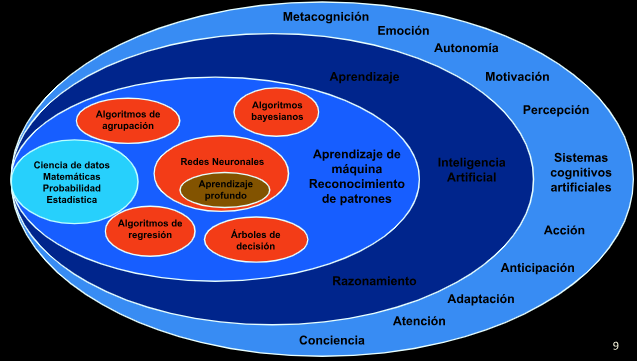
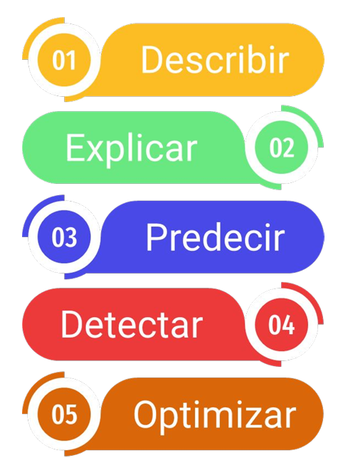

# Tema2_TrabajoColaborativo
Carlos Andres Giraldo Saldarriaga

Maria Victoria Valencia Arango

## Historia y ciclo de vida de una aplicación de Aprendizaje de Máquina

Se describirán a continuación las etapas o fases del ciclo de vida para aplicaciones de aprendizaje de máquinas.

1. Identificación del problema
2. Recolección de datos
3. Preparación de datos
4. Ingeniería de modelos
5. Evaluación del modelo
6. Despliegue
7. Mantenimiento y actualización

De acuerdo con las etapas mencionadas, se debe tener en cuenta que para iniciar a desarrollar, es importante conocer el reto a resolver, tener claridad del contexto del problema y de esta manera avanzar con las demás etapas donde se encuentran involucrados los datos: recolección, proceso de limpieza y calidad de datos para posteriormente iniciar el modelado analítico de acuerdo a la necesidad del negocio.

Adicionalmente, se requiere hacer una evaluación del modelo para evidenciar posibles mejoras y posteriormente hacer los despliegues correspondientes para los pasos a producción.

Los diferentes tipos de aprendizaje de máquina son los siguientes:

- Ciencia de datos, Matemáticas, Probabilidad estadística.
- Algoritmos de agrupación.
- Redes neuronales.
    * Aprendizaje profundo.
- Algoritmos bayesianos.
- Algoritmos de regresión.
- Árboles de decisión.

## Preparación de datos

- Análisis exploratorio de los datos: Conocer la tipología y cómo llegan los datos de la fuente.
    * Evaluación de nulos.
    * Datos faltantes.
    * Duplicidad.
    * Tipos de datos.
- Limpieza de datos: Se busca organizar la data para evitar fallos en los modelos analíticos posteriores.

Existen diferentes tipos de análisis:

- Exploratorio
- Descriptivo
- Relacional
- Explicativo
- Predictivo

## Analítica de datos

Una vez se tienen los datos limpios y de calidad, se procede a tener conjuntos de entrenamiento y prueba de acuerdo a los modelos que vamos a utilizar.
Esto permitirá al modelo aprender sobre los datos y posteriormente hacer testeo sobre ellos.
Para estos conjuntos de entrenamientos se pueden tomar porciones de datos 70% para entrenamiento y 30% para testeo, ó tomar 80% para entrenamiento y 20% para testeo.

- Selección de modelo
    * Supervisado
        * Clasificación
        * Regresión
    * No supervisado
        * Agrupaciones (clustering)

Paula Rocio Jacobo Marin

Daniel Calle Pulgarin

Jaime Andrés Londoño Acevedo

Ximena Perez Burgos

Wilmer Jamioy Tisoy 

Jhoksser Fernando Mejía Ramos

Victor Alfonso Gutierrez Lopez

Maritza Cristina Parra Jimenez

Robinson Loaiza Davila

Claudia Lorena Ramírez Franco

Roberto Alejandro Sánchez

## Analítica de datos

Una vez se tienen los datos limpios y de calidad, se procede a tener conjuntos de entrenamiento y prueba de acuerdo a los modelos que vamos a utilizar.
Esto permitirá al modelo aprender sobre los datos y posteriormente hacer testeo sobre ellos.
Para estos conjuntos de entrenamientos se pueden tomar porciones de datos 70% para entrenamiento y 30% para testeo, ó tomar 80% para entrenamiento y 20% para testeo.

Claudia Cardenas

Luis Angel Montoya Suárez 

Yessica Marcela Triana Cordoba

Luis Fernando Meneses Caviedes

Sebastian de Jesus Garcia Lopez

Valentina Cepeda Duque

Juan Diego Araque Muñoz

José Luis Cardeño Tejada

Geovanny Vergara Ramírez 

Carlos Perea

Juan Pablo Guzmán Moreno

Maria Camila Castro Isa

Diana Carolina Arias Valencia

Edisson Ferley Echavarria Marin

Diana Maribel Balaguera Arroyave

Sebastian Castañeda Garcia
